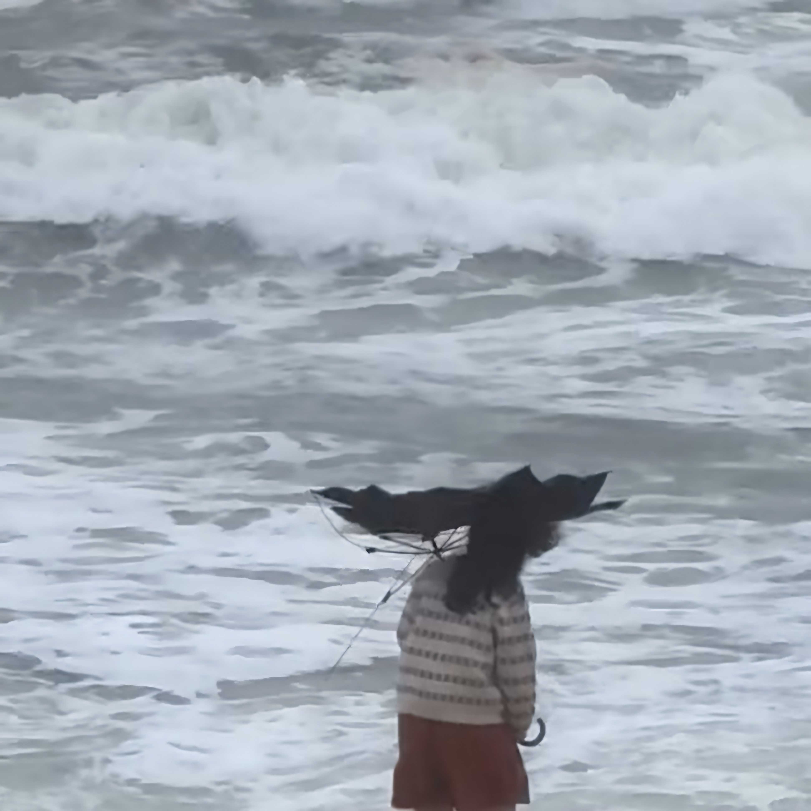

# Hello World 홈페이지
## 안녕하세요 윤지윤 입니다.
  
 ###### 파도처럼 너에게 가겠다.

## 즐겨찾기
 [네이버 링크](https://www.naver.com)링크링크. [구글 링크](https://www.google.com) [혅](https://rustylake92.github.io/hello-world/) [혦](https://hm0o0b.github.io/helloworld/)

## bgm
<iframe width="640" height="360" src="https://www.youtube.com/embed/rr5V5eZD6TE" title="𝐏𝐥𝐚𝐲𝐥𝐢𝐬𝐭 노래만 잘 골라도 하루종일 상쾌해요🌈🤍 | 설레는 아침을 열어주는 감성 팝송 ✨" frameborder="0" allow="accelerometer; autoplay; clipboard-write; encrypted-media; gyroscope; picture-in-picture; web-share" referrerpolicy="strict-origin-when-cross-origin" allowfullscreen></iframe>

# hello-world
test repository

# markdown language
1.순서1
2.순서2
3.순서3

## sub title
### 3rd title
 - item1
 - itme2
 - item3
 - item4

* 곱하기
  + 더하기
     - 빼기
   
